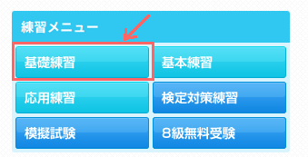
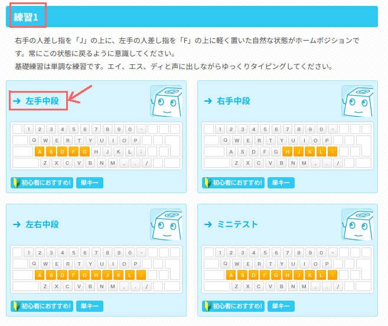
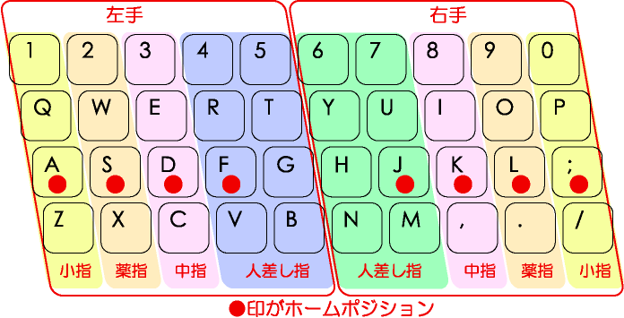
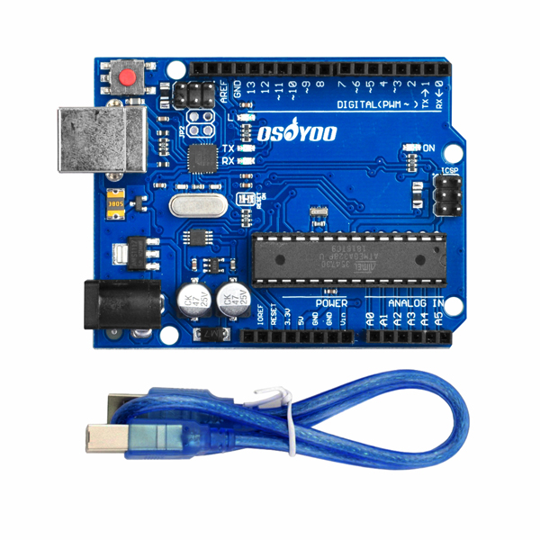
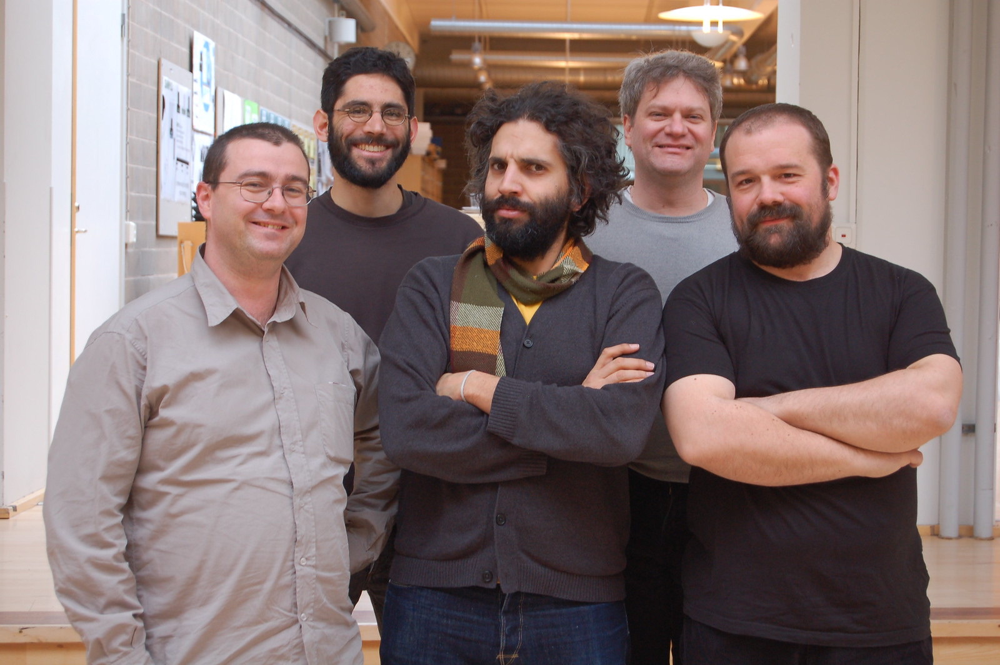

# レッスン0 オリエンテーション -ロボ部へようこそ！-

## ロボ部はこんな活動です！

こんにちは！アイアルクの**ロボ部**のレッスンへようこそ！ロボ部ではいままでよりも本格的なロボットのレッスンが学べます。ロボ部で使うロボットはこれ！

カッコイイよね。このロボットを少しずつ作りながら最後は**対戦ゲーム**を行う予定です。

これはLEGOなどで動いていたロボットとは違って、部品が丸出しになっています。だから、センサーやモーターの**原理がより深く**学べるんだ！

その代わり囲われていない分、壊れやすいとも言えます。このロボットはみんなひとりひとり自分のロボットをお家の人に買ってもらったものだから、**大切**に使ってくださいね。壊れたときはそのパーツを別に買ってもらうことになります！

### このレッスンで身につける力
- [ ] Aruduinoについて理解する
- [ ] レッスンの進め方が理解できる
- [ ] まとめページを作成出来る
- [ ] タイピングの指の対応を覚える

## ロボ部でのレッスンの進め方
ロボ部でのレッスンの進め方を説明していくよ。ロボ部の進め方はこんな感じです。
1. ウォーミングアップ15〜20分（タイピングや計算プリント）
2. 今日のまとめページを作成
3. 自分でテキストを見ながらレッスンを進める
4. 残り時間15分くらいになったらまとめ

まとめページは自分の学習の記録になるホームページ。今までの先輩たちのページはこちら。

https://www.aiaruku.com/parent/record

>[!TIP]
>まとめページの作り方は先生に聞いて作ろう

## タイピング
ロボ部ではタイピングの練習もウォーミングアップとしてやっていくよ。タイピングの練習はこんな感じで進めていこう。
1. [イータイピング](https://www.e-typing.ne.jp/)を使ってキーの配置とローマ字を覚える
2. [タイピンガーゼット](https://typingerz.com/)などのタイピングゲームで楽しみながら上達していく
3. スコア（WPM）を記録して、自分の上達を目に見えるようにグラフにしていこう！
>[!TIP]
>WPMの記録はスプレッドシートで記録をしていくよ。やり方を先生に聞こう！

では、さっそく [イータイピング](https://www.e-typing.ne.jp/)をクリックしてタイピングの練習を進めていこう！まずはじめに中段の指とキーを覚えよう。それができたらどんどん進んでいこう！

### 進め方

指とキーを覚えよう！

## Aruduino（アルディーノ）について

ロボ部のロボットの頭脳とも言えるコンピュータを**Aruduino**といいます。これはイタリアのある王様の名前から取られたもの。2005年にいままで高くて教育用には使えなかったマイコンを**安く多くの人に**使ってもらえるように、と開発されたものなんだ。

安くてシンプルで使いやすいと評判になって世界中の電子工作や電気回路、プログラムを学ぼうとしている人たちに使われています。その中には子どもだけじゃなくて大学や企業でしっかりと学ぼうとしている人たちも含まれているんだ。

この人たちがArduinoを作った人たちだよ。

出典:https://www.flickr.com/photos/dcuartielles/2363657276/

## まとめ
### 考えてみよう　

次の問いを考えてノートに答えを書いてみましょう

1. Aruduino（アルディーノ）を使うメリットは何ですか？
2. Aruduino（アルディーノ）を作ろうとした理由は何でしょうか？

### できたことにチェックをしよう
- [ ] Aruduinoについて理解する
- [ ] レッスンの進め方が理解できる
- [ ] まとめページを作成出来る
- [ ] タイピングの指の対応を覚える

> [!IMPORTANT]
> 重要！チェックリストはスクリーンショットを取ってまとめページに貼り付けよう！
