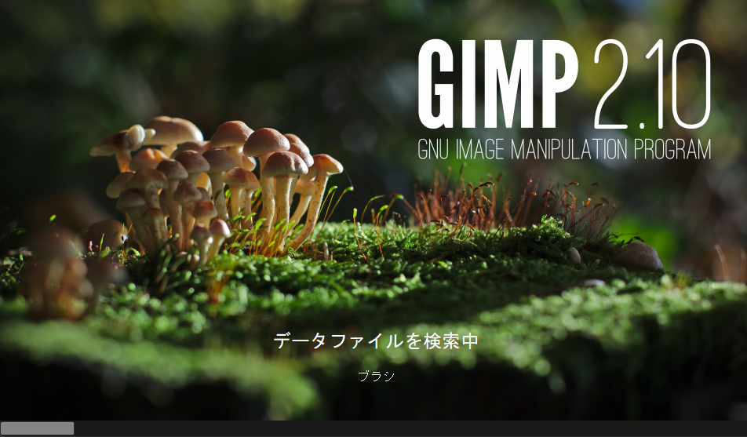
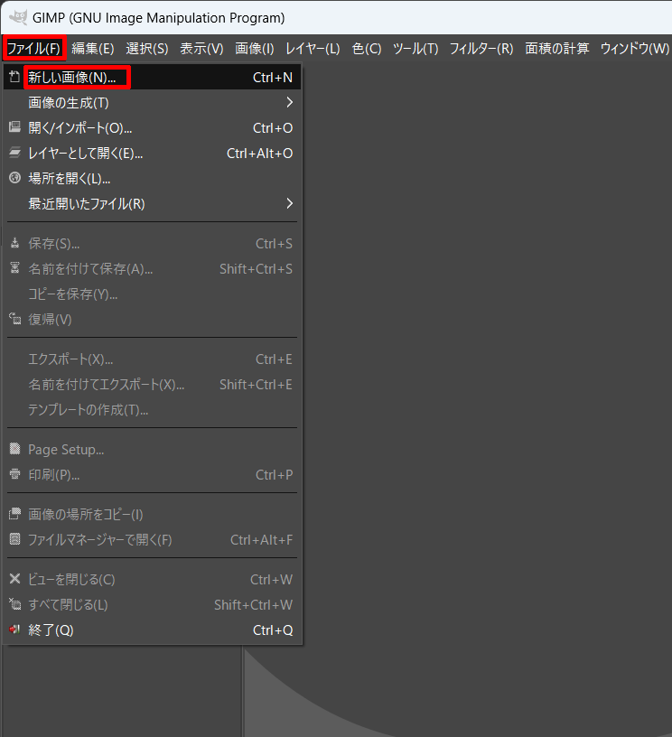
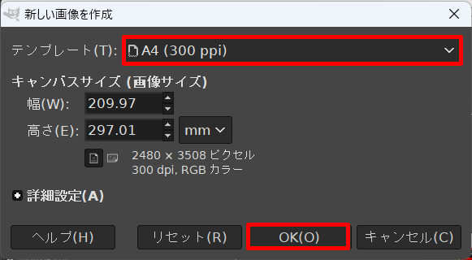
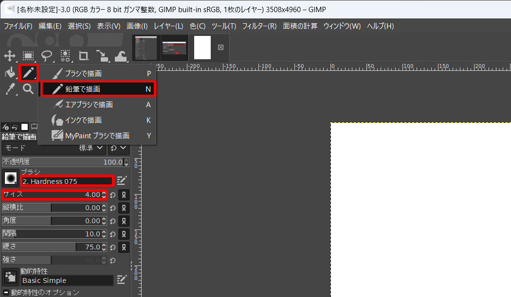

# レッスン02 オープンソースに触れよう
## オープンソースという自由

Aruduinoは**オープンソース**という考え方で作られていて、非常に安価に使うことができます。

オープンソースとは **「誰でもソフトウェアを使える、作れる、改造できる」**　という方針で作られたプログラムのことです。そのためにプログラムの設計図が公開されています。公開されているということは誰でも真似をしたり改造したりできます。だから、プログラムを学ぶことにはとても都合がいいんですね。

そうやっていろいろな人が作ったくさんのAruduinoとそこで動くプログラムが公開されていて、それを使うことができます。これらの先人の作ったものを利用させてもらいながら、自分で新しいものを作るという仕組みがオープンソースになります。

このレッスンではオープンソースの考え方を身に着けていきましょう。

### このレッスンで身につける力
- [ ] オープンソースのメリットとデメリットを理解する
- [ ] オープンソースのソフトウェアにどんなものがあるか知る
- [ ] オープンソースのお絵かきソフトGIMPを使ってみる

### オープンソースのメリットとデメリット
オープンソースには次のようなメリットがあります。

* **無料**で使える
* **自由に**問題を修正したり、機能を追加したり出来る
* **自由に**ビジネスで利用できる
* 作る人、使う人の集まり(**コミュニティ**)があり、サポートがもらえる

その一方で**自己責任である**という特徴があります。使っていて何かしらの**トラブルがあっても自分で解決**してください、というスタンスで一般的なアプリよりも少しハードルが高くなっています。

この反対にソースコードを公開しないソフトウェアもあります。例えばパソコンの基本ソフトである「**ウィンドウズ**」や表計算ソフトの「**エクセル**」絵を書いたり写真を修正したり出来る「**フォトショップ**」など有名なソフトウェアは殆どがオープンソースではありません。ソフトウェアの開発にはたくさんのお金がかかりますから、無料で公開してしまっては、その開発費を賄うことができないので当然と言えば当然です。

オープンソースは多くのボランティアのプログラマーさんたちに支えられた活動です。**「ソフトウェアはみんなのもの」**という高い志によって多くのソフトウェアやサービスが開発されていて、コンピュータの世界を動かす原動力になっています。大きなオープンソース活動に関わることは**一流のソフトウェア開発者の証のようにもなっている大変名誉なこと**でもあります。

## オープンソースソフトフェアにはどんなものがあるだろう？

オープンソースソフトウェアには以下のようなものがあります。
1. [**Linux(リナックス)**](https://jp.ubuntu.com/) ：基本ソフトウェア（OS)。⇔ウィンドウズ
2.  [**LibreOffice(リブレオフィス)**](https://ja.libreoffice.org/) ：オフィスソフト⇔ワード、エクセル、パワーポイント
3.  [**GIMP(ギンプ)**](https://www.gimp.org/) ：画像レタッチソフト⇔ フォトショップ

## GIMPを使ってみよう
試しにGIMPを使ってみましょう。楽しいお絵かきソフトですが、ものすごく高性能です。

デスクトップにあるのアイコンをクリックしてGIMPを立ち上げてみましょう。

では、GIMPを使ってお絵描きをしてみましょう。

「ファイル」＞「新しい画像」とクリックして白紙のページを作ってみよう。

テンプレートを選んで画像の大きさを決めたらOKを押そう。

白紙のキャンパスが出てきたら鉛筆ツールで何か書いてみよう。

GIMPのより詳しい使い方については[ここ](https://gazocustomize.com/gimp/)や検索を使って調べてみよう。

## まとめ
### 考えてみよう　

次の問いを考えてノートに答えを書いてみましょう

1. オープンソースを使うメリットは何ですか？
2. オープンソースを使うデメリットは何ですか？
3. あなたが使ってみたいオープンソースのソフトウェアは何ですか？

### できたことにチェックをしよう
- [ ] オープンソースのメリットとデメリットを理解する
- [ ] オープンソースのソフトウェアにどんなものがあるか知る
- [ ] オープンソースのお絵かきソフトGIMPを使ってみる
> [!IMPORTANT]
> 重要！チェックリストはスクリーンショットを取ってまとめページに貼り付けよう！

